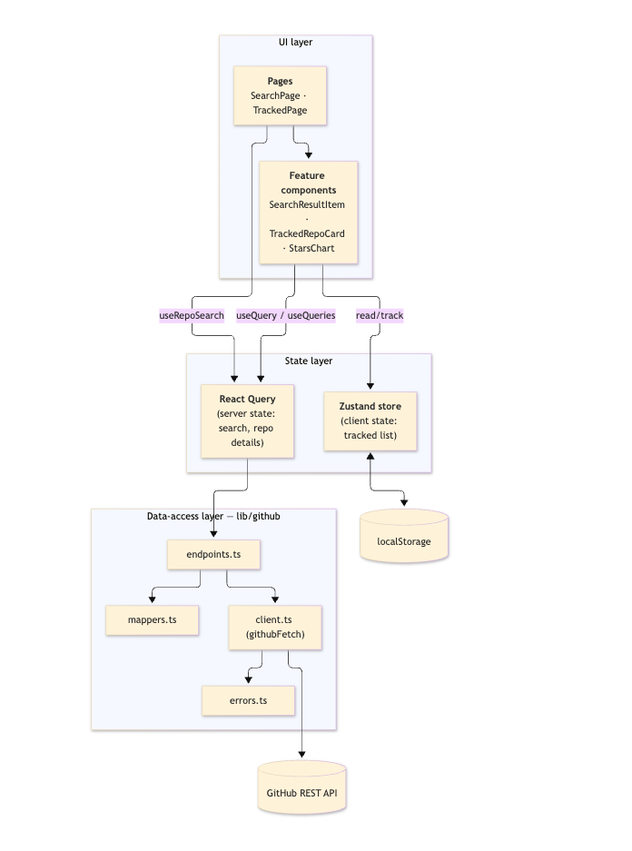
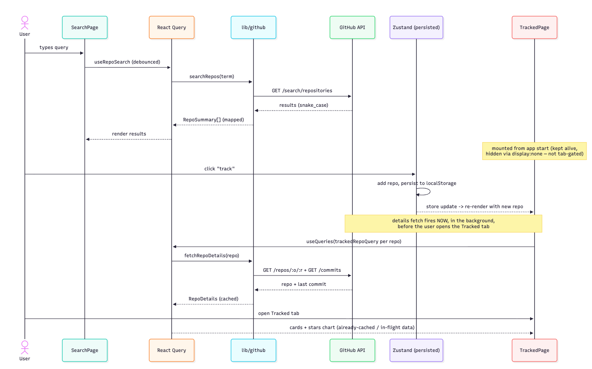

# Repo Radar

A small React dashboard for **discovering and tracking GitHub repositories**. Search the GitHub API, bookmark repos you care about, and watch their key stats — stars, open issues, and last-commit recency — on a dedicated tracked view with a stars comparison chart. Tracked repos persist across reloads, and the UI ships with light/dark theming.

---

## Table of contents

- [Features](#features)
- [Tech stack](#tech-stack)
- [Getting started](#getting-started)
- [Available scripts](#available-scripts)
- [Project structure](#project-structure)
- [Architecture](#architecture)
- [Design decisions](#design-decisions)
- [GitHub API usage](#github-api-usage)
- [Known limitations](#known-limitations)
- [Future work](#future-work)

---

## Features

- **Search** GitHub repositories with a debounced query.
- **Track / untrack** repositories; the list is **persisted to `localStorage`**.
- **Tracked dashboard** with per-repo cards (stars, open issues, last commit) and a **stars comparison bar chart**.
- **Per-card and "refresh all"** re-fetching, with background-fetch indicators.
- **Light / dark theme** with a header toggle that follows the system preference by default and remembers your choice.
- **Typed, user-friendly error handling** (not-found, rate-limit, network) with retry affordances.

---

## Tech stack

| Concern       | Choice                                                     | Why                                                                      |
| ------------- | ---------------------------------------------------------- | ------------------------------------------------------------------------ |
| Framework     | **React 19** + **TypeScript**                              | Modern React with strict typing.                                         |
| Build tool    | **Vite**                                                   | Fast dev server and build.                                               |
| Server state  | **TanStack Query (React Query) v5**                        | Caching, dedup, background refetch, retry policy for remote data.        |
| Client state  | **Zustand v5** (`persist`)                                 | Tiny, ergonomic store for the tracked list; persisted to `localStorage`. |
| UI components | **MUI (Material UI) v9** + Emotion                         | Accessible component library + theming.                                  |
| Charts        | **MUI X Charts v9**                                        | Bar chart for the stars comparison.                                      |
| Linting       | **ESLint** (typescript-eslint, react-hooks, react-refresh) | Consistency and correctness.                                             |

No backend — the app talks directly to the public GitHub REST API from the browser.

---

## Getting started

### Prerequisites

- **Node.js ≥ 20.19** (developed on Node 24)
- **pnpm** (developed on pnpm 10) — `npm i -g pnpm`

### Install & run

```bash
pnpm install      # install dependencies
pnpm dev          # start the dev server (http://localhost:5173)
```

That's it — **no environment variables or API keys are required**. The app uses the GitHub API unauthenticated (see [Known limitations](#known-limitations) for the rate-limit trade-off).

### Production build

```bash
pnpm build        # type-check (tsc -b) + bundle (vite build) -> dist/
pnpm preview      # serve the built bundle locally
```

---

## Available scripts

| Script         | Description                                                        |
| -------------- | ------------------------------------------------------------------ |
| `pnpm dev`     | Start the Vite dev server with HMR.                                |
| `pnpm build`   | Type-check the project and produce a production bundle in `dist/`. |
| `pnpm preview` | Preview the production build locally.                              |
| `pnpm lint`    | Run ESLint over the codebase.                                      |

---

## Project structure

The codebase is organized by **feature** and by **layer**, keeping remote-data concerns, client state, and UI cleanly separated.

```
src/
├─ app/                     # App-wide wiring (providers, theme, query client)
│  ├─ providers.tsx         # Composes QueryClientProvider + ThemeProvider
│  ├─ ThemeProvider.tsx     # Light/dark MUI theme provider + persistence
│  ├─ themeMode.ts          # Theme-mode context + useThemeMode() hook
│  ├─ theme.ts              # createAppTheme(mode) — palettes, typography, overrides
│  ├─ queryClient.ts        # React Query client + default options / retry policy
│  └─ AppLayout.tsx         # App bar, tab navigation, theme toggle
│
├─ pages/                   # Top-level views
│  ├─ SearchPage.tsx
│  ├─ TrackedPage.tsx
│  └─ registry.ts           # Page metadata (label, icon, component)
│
├─ features/                # Feature-scoped UI + hooks
│  ├─ search/
│  │  ├─ components/         # SearchInput, SearchResultItem
│  │  └─ hooks/              # useRepoSearch (debounced query)
│  └─ tracked/
│     ├─ components/         # TrackedRepoCard, StarsChart
│     ├─ helpers/            # trackedRepoQuery (queryOptions factory)
│     └─ hooks/              # useTrackedRepo
│
├─ lib/
│  ├─ github/               # GitHub data-access layer
│  │  ├─ client.ts          # githubFetch<T>() — fetch wrapper + error mapping
│  │  ├─ endpoints.ts       # searchRepos, fetchRepo, fetchLastCommit, fetchRepoDetails
│  │  ├─ mappers.ts         # API (snake_case) -> domain (camelCase)
│  │  ├─ types.ts           # API shapes + domain types
│  │  ├─ errors.ts          # GitHubError + typed error kinds
│  │  └─ queryKeys.ts       # Centralized React Query key factory
│  └─ formatRelativeDate.ts # "2 days ago" formatting
│
├─ store/
│  └─ trackedRepos.ts       # Zustand store (persisted list of tracked repos)
│
├─ components/              # Shared UI (GitHubErrorAlert)
├─ hooks/                   # Shared hooks (useDebouncedValue)
└─ helpers/                 # Shared helpers (sameRepo)
```

---

## Architecture

### Layered overview



### Data flow: search → track → dashboard



---

## Design decisions

- **Server state vs. client state are separated.** Remote data (search results, repo details) lives in **React Query** — it owns caching, deduplication, background refetching, and retries. The **only** genuinely client-owned state is the _list of tracked repos_, which lives in **Zustand** and is persisted. This avoids the common trap of stuffing server data into a global store and hand-rolling cache logic.

- **A thin, typed data-access layer (`lib/github`).** All network access goes through `githubFetch<T>()`, which centralizes base URL, headers, and — importantly — **error normalization**. HTTP failures become a typed `GitHubError` with a discriminated `kind` (`not_found` | `rate_limit` | `network` | `unknown`), so the UI can branch on _meaning_ rather than raw status codes.

- **API shapes are mapped to domain types.** `mappers.ts` converts GitHub's `snake_case` payloads into the app's `camelCase` domain models (`RepoSummary`, `RepoDetails`). The rest of the app never sees the raw API shape, which keeps the surface area small and refactors local.

- **Centralized query-key factory (`queryKeys.ts`).** Keys like `github → search → term` and `github → tracked → owner/name` are built in one place, so cache reads, invalidation ("refresh all"), and background-fetch indicators stay consistent and typo-free.

- **`queryOptions` factory for tracked repos.** `trackedRepoQuery()` returns a shared query config reused by both `useQuery` (single card) and `useQueries` (the chart), guaranteeing they hit the same cache entry instead of double-fetching.

- **Resilient details fetch.** `fetchRepoDetails` fetches the repo and its last commit in parallel. An **empty repository** returns `409` on the commits endpoint — a valid state, not a failure — so that specific case degrades to "no commits" while all other errors still surface.

- **Debounced search.** `useDebouncedValue` (500 ms) plus `enabled: term.length > 0` and `keepPreviousData` keeps the results list stable while typing and avoids a request per keystroke.

- **Unauthenticated by design.** The app reads only public data, so it runs without a token — zero setup for reviewers. See the trade-off below.

- **Navigation via local state (intentionally minimal).** With only two views, tab state is a single `useState` in `App` rather than a router dependency — see [Future work](#future-work) for when that changes.

- **Both tabs stay rendered (not tab-guarded).** `App` renders _both_ pages simultaneously and only toggles visibility with `display: none`, instead of conditionally mounting the active one. Because `TrackedPage` is therefore always mounted, its queries are live from app start: **tracking a repo triggers its details fetch immediately in the background**, so the data is already cached (or in flight) by the time you open the Tracked tab. It also preserves each tab's local state (e.g. the search box) across switches. The trade-off is that `TrackedPage`'s queries run even in a session where the tab is never opened — an acceptable call for a two-tab app, and one that would naturally change under route-based mounting (see [Future work](#future-work)).

- **Theming.** A `createAppTheme(mode)` factory drives light/dark palettes and component overrides; `ThemeProvider` defaults to the system preference and persists the user's explicit choice to `localStorage`.

---

## GitHub API usage

| Feature            | Endpoint                                       |
| ------------------ | ---------------------------------------------- |
| Repository search  | `GET /search/repositories?q=…&per_page=10`     |
| Repository details | `GET /repos/{owner}/{repo}`                    |
| Last commit        | `GET /repos/{owner}/{repo}/commits?per_page=1` |

---

## Known limitations

- **Unauthenticated rate limit.** Without a token, GitHub allows **~60 requests/hour per IP**. Each tracked repo costs 2 requests (details + last commit), plus one per search. Heavy use can hit `403 rate_limit` — the UI reports this clearly, and caching (`staleTime`) reduces churn, but it's a ceiling to be aware of.
- **Search is capped at 10 results** with no pagination.
- **No automated tests** yet.
- The production bundle is a **single large chunk** (MUI + charts) — no code-splitting yet.

---

## Future work

- **Routing** — adopt a router (e.g. React Router) for real URLs, deep-linking to a view, and browser back/forward support, replacing the current `useState`-based tab switch.
- **Pagination** — page or infinitely scroll search results beyond the first 10 (`per_page` / `page` params), with "load more" or virtualization.
- **Testing** — unit tests for the mappers/error handling and component tests for the search/track flows (Vitest + Testing Library).
- **Performance** — route-based code-splitting and lazy-loading the charts to shrink the initial bundle.
- **Richer insights** — additional charts (e.g. stars-share donut, a "repo health" radar, or commit-activity sparklines per card).
